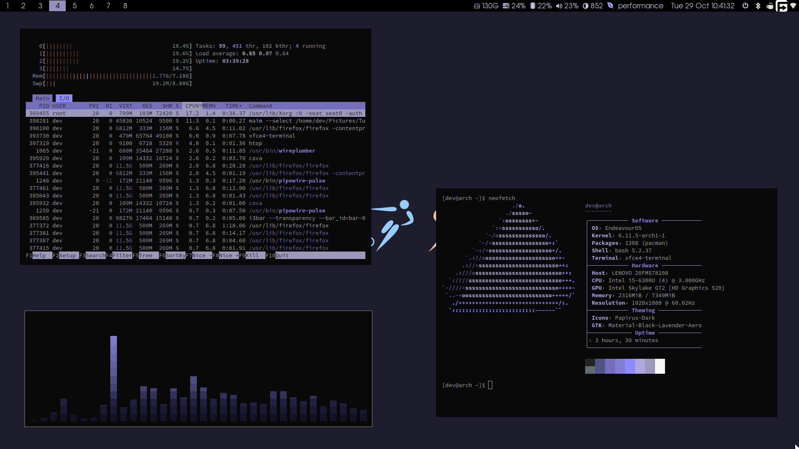

# A simple setup for i3wm and some tools based on [stock EndeavourOS config for i3](https://github.com/endeavouros-team/endeavouros-i3wm-setup).

# **Dependencies**:
- [i3wm](https://github.com/i3/i3) (X11 tiling window manager)
- [i3blocks](https://github.com/vivien/i3blocks) (status bar feed generator for i3)
- [picom](https://github.com/yshui/picom) (compositor)
- [rofi](https://github.com/davatorium/rofi) (dmenu alternative)
- [xfce4-terminal](https://github.com/xfce-mirror/xfce4-terminal) (xfce terminal emulator)
- [neofetch](https://github.com/dylanaraps/neofetch) (system info fetching tool)
- [cava](https://github.com/karlstav/cava) (audio visualizer)
- [pulseaudio](https://github.com/pulseaudio/pulseaudio) (audio server)
- [feh](https://github.com/derf/feh) (wallpaper setter + image viewer)
- [dunst](https://github.com/dunst-project/dunst) (notification daemon)
- [xclip](https://github.com/astrand/xclip) (clipboard utility)
- [maim](https://github.com/naelstrof/maim) (screenshot utility used together with xclip)
- [scrot](https://github.com/resurrecting-open-source-projects/scrot) (screenshot tool)
- **fonts**: [Avant Garde Regular](https://www.fontsplace.com/avant-garde-regular-free-font-download.html), [AvantGarde Medium](https://www.fontsplace.com/avant-garde-medium-free-font-download.html)
- **extra**: an edit of [Material-Black](https://www.gnome-look.org/p/1316887) GTK theme featuring lavender colors and transparency is included
- **tip**: use [Papirus Icon Theme](https://github.com/PapirusDevelopmentTeam/papirus-icon-theme) along with [Catppuccin](https://github.com/catppuccin/papirus-folders) for matching icons

# **Installation**:

- **1. For an EndeavourOS i3 installation**: download and install the fonts, drop the folders into your home folder (overwriting when asked to), open [nwg-look](https://github.com/nwg-piotr/nwg-look), apply the Material-Black-Lavender-Aero GTK theme and restart the session

- **2. Other (for Arch-based distros)**: download and install the fonts, run `yay -S i3 picom rofi xfce4-terminal neofetch cava xclip maim pulseaudio feh dunst scrot polkit-gnome nwg-look` and drop the files into your home folder, apply the GTK theme with nwg-look, for other distros use your respective package manager to download everything listed
